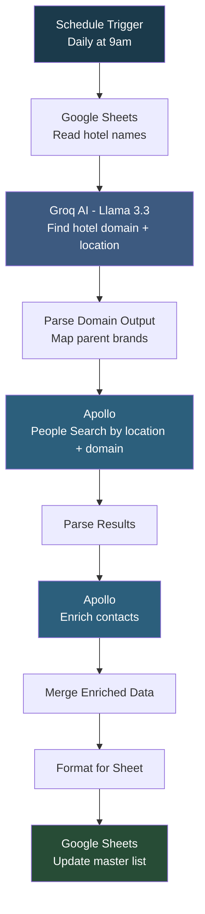

# Hotel Lead Generation

## Overview

This automation **finds decision-makers at hotels from a list and enriches their contact details daily**. It reads hotel names from a Google Sheet, uses Groq AI (Llama 3.3 70B) to find each hotel's specific domain (not the parent brand like marriott.com), searches Apollo for General Managers and Housekeeping Directors at those locations, enriches contacts with emails and phone numbers, and writes everything back to the master sheet. It handles major hotel chains by mapping to parent brand domains as fallback.

## How It Works

```
Schedule (daily 9am) -> Read Hotel Names -> AI Find Hotel Domain -> Apollo People Search -> Enrich Contacts -> Format -> Update Sheet
```

### Workflow Diagram



## Integrations

- **Groq (Llama 3.3 70B)** - Hotel domain and location extraction
- **Apollo.io** - People search and contact enrichment
- **Google Sheets** - Hotel list and lead output

## Setup

1. Import `Hotel_Lead_Generation.json` into your n8n instance.
2. Update credentials for Groq, Apollo, and Google Sheets.
3. Update the Google Sheet document ID to point to your hotel list.
4. Activate the workflow to run daily at 9am.
